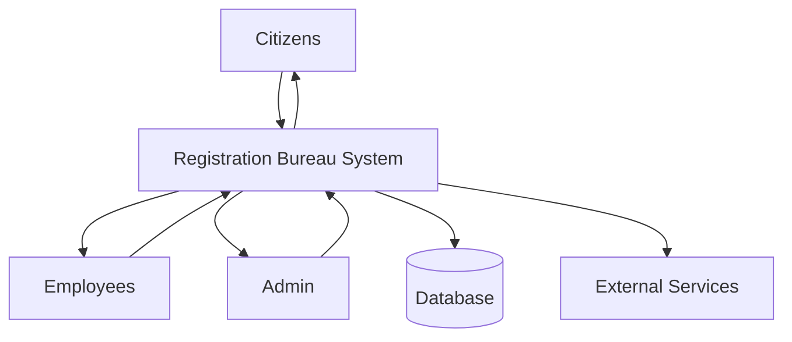
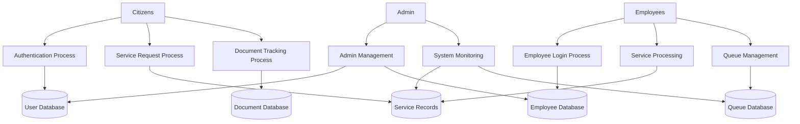
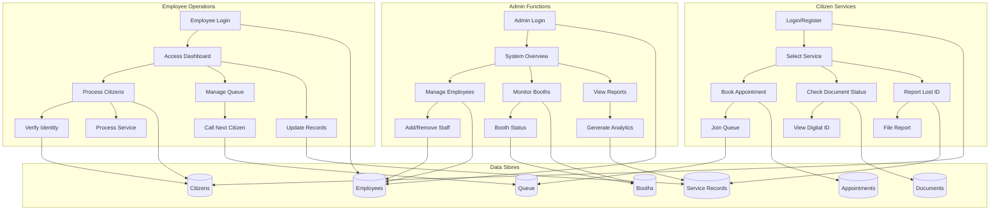

# Data Flow Diagram (DFD)
## Nairobi Registration Bureau - Employee System

## Level 0 - Context Diagram

## Level 1 - System Overview

## Level 2 - Detailed Process Flow

## Data Flow Details

### External Entities
- **Citizens**: End users seeking registration services
- **Employees**: Staff operating service booths
- **Admin**: System administrators and managers

### Processes
1. **Authentication Process**: User login and verification
2. **Service Request Process**: Citizens requesting services
3. **Document Tracking Process**: Monitoring document production
4. **Employee Login Process**: Staff authentication
5. **Service Processing**: Handling citizen requests
6. **Queue Management**: Managing citizen queues
7. **Admin Management**: System administration
8. **System Monitoring**: Performance and analytics

### Data Stores
- **User Database**: Authentication and profile data
- **Service Records**: Transaction history
- **Document Database**: Document production tracking
- **Employee Database**: Staff information
- **Queue Database**: Real-time queue status