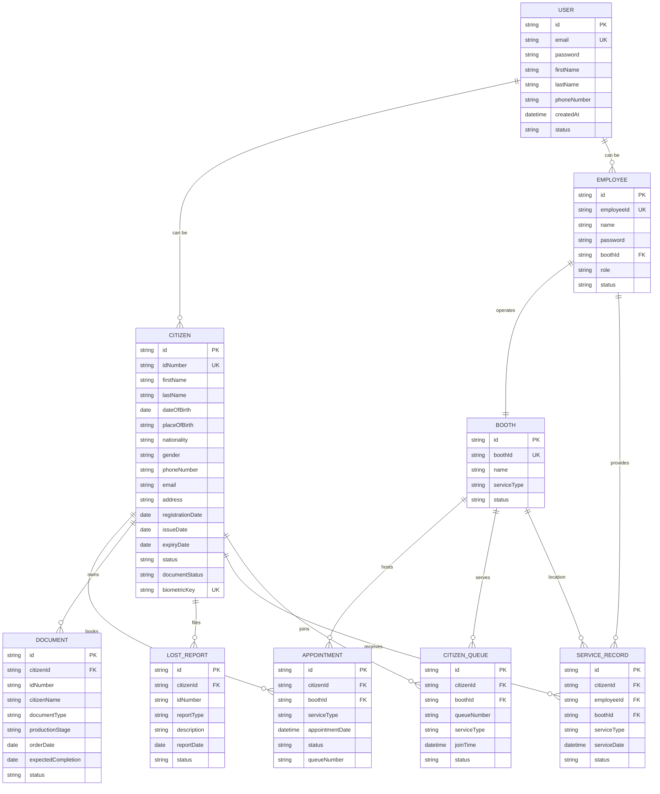

# Entity Relationship Diagram (ERD)
## Nairobi Registration Bureau - Employee System

```mermaid
erDiagram
    USER ||--o{ CITIZEN : "can be"
    USER ||--o{ EMPLOYEE : "can be"
    
    USER {
        string id PK
        string email UK
        string password
        string firstName
        string lastName
        string phoneNumber
        datetime createdAt
        string status
    }
    
    CITIZEN {
        string id PK
        string idNumber UK
        string firstName
        string lastName
        date dateOfBirth
        string placeOfBirth
        string nationality
        string gender
        string phoneNumber
        string email
        string address
        date registrationDate
        date issueDate
        date expiryDate
        string status
        string documentStatus
        string biometricKey UK
    }
    
    EMPLOYEE {
        string id PK
        string employeeId UK
        string name
        string password
        string boothId FK
        string role
        string status
    }
    
    BOOTH {
        string id PK
        string boothId UK
        string name
        string serviceType
        string status
    }
    
    APPOINTMENT {
        string id PK
        string citizenId FK
        string boothId FK
        string serviceType
        datetime appointmentDate
        string status
        string queueNumber
    }
    
    DOCUMENT {
        string id PK
        string citizenId FK
        string idNumber
        string citizenName
        string documentType
        string productionStage
        date orderDate
        date expectedCompletion
        string status
    }
    
    LOST_REPORT {
        string id PK
        string citizenId FK
        string idNumber
        string reportType
        string description
        date reportDate
        string status
    }
    
    SERVICE_RECORD {
        string id PK
        string citizenId FK
        string employeeId FK
        string boothId FK
        string serviceType
        datetime serviceDate
        string status
    }
    
    CITIZEN_QUEUE {
        string id PK
        string citizenId FK
        string boothId FK
        string queueNumber
        string serviceType
        datetime joinTime
        string status
    }
    
    CITIZEN ||--o{ APPOINTMENT : "books"
    CITIZEN ||--o{ DOCUMENT : "owns"
    CITIZEN ||--o{ LOST_REPORT : "files"
    CITIZEN ||--o{ SERVICE_RECORD : "receives"
    CITIZEN ||--o{ CITIZEN_QUEUE : "joins"
    
    EMPLOYEE ||--|| BOOTH : "operates"
    EMPLOYEE ||--o{ SERVICE_RECORD : "provides"
    
    BOOTH ||--o{ APPOINTMENT : "hosts"
    BOOTH ||--o{ CITIZEN_QUEUE : "serves"
    BOOTH ||--o{ SERVICE_RECORD : "location"
```